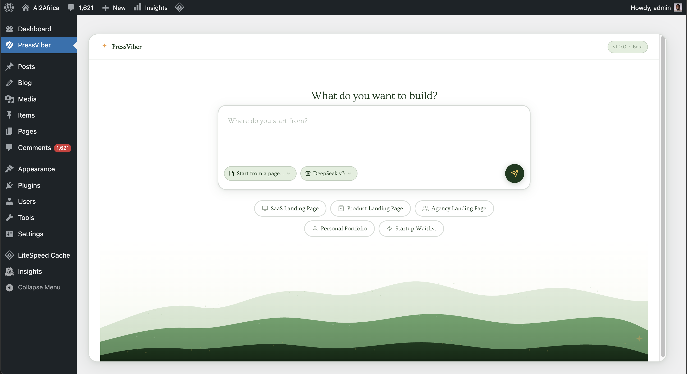
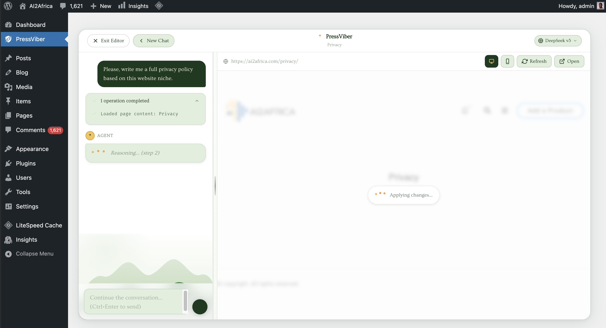
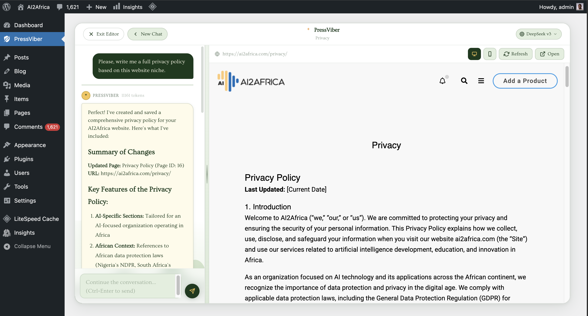

# PressViber — AI Agent for WordPress

> **Build, edit, and manage your WordPress site through a natural language chat interface — powered by DeepSeek v3 and GPT-4.**

PressViber embeds an agentic AI directly inside your WordPress admin dashboard. Describe what you want in plain English and the agent reads your site, finds the right files, edits them, and verifies the result — all without leaving WordPress.

---

## Table of Contents

- [Overview](#overview)
- - [Screenshots](#screenshots)
- [Features](#features)
- [How It Works](#how-it-works)
- [Installation](#installation)
- [Configuration](#configuration)
- [Agent Tools](#agent-tools)
- [Architecture](#architecture)
- [Vercel Agent Runtime](#vercel-agent-runtime)
- [Requirements](#requirements)
- [Roadmap](#roadmap)
- [Contributing](#contributing)
- [License](#license)

---

## Overview

PressViber is an open-source WordPress plugin that gives you a conversational AI interface for making site changes. Instead of hunting through theme files, the Customizer, and the page editor separately, you describe your goal once and the agent figures out the right place to make the change.

```
You:    "Change 'Explore by Region' to 'Browse by Region' on the homepage"
Agent:  ✔  Searched theme and custom plugins for the text
        ✔  Found it in ai2africa-company-profile.php line 847
        ✔  Replaced text using replace_text_in_file
        ✔  Verified: fetched rendered page, new text confirmed
```

---

## Screenshots

### PressViber Plugin Homepage

*The main PressViber interface in the WordPress admin dashboard*

### PressViber with Prompt Inputted

*User entering a natural language command in the chat interface*

### PressViber Task Completed

*The agent successfully completing a site modification task*

---

## Features

- **Natural language editing** — describe changes in plain English
- **50+ WordPress tools** — pages, posts, menus, theme settings, widgets, file system, shell commands
- **Intelligent text discovery** — `find_page_element` locates visible text by rendering the live page, so the agent never has to guess which template is in use
- **Multi-model support** — DeepSeek v3 (default, fast & cheap) and GPT-4 (coming soon, Claude coming soon)
- **Safe file operations** — sandboxed file manager; deleted files go to `.aivb_trash/` not the void
- **Streaming responses** — results stream token-by-token via Server-Sent Events so you see progress live
- **Conversation history** — multi-turn context so you can iterate ("now make the font bigger")
- **Template chips** — one-click prompts for common tasks (SaaS landing page, portfolio, waitlist, etc.)
- **Vercel runtime** — optional external agent runtime deployable to Vercel Edge for faster response times

---

## How It Works

1. You type a task in the chat interface inside the WordPress admin.
2. The plugin streams the request to the AI (DeepSeek v3 via OpenAI-compatible API).
3. The AI responds with **tool calls** — structured instructions like `find_page_element`, `replace_text_in_file`, or `update_page_content`.
4. The PHP agent layer executes each tool call against your live WordPress installation.
5. Tool results feed back into the conversation so the AI can continue, verify, or self-correct.
6. The loop runs up to **15 iterations** until the task is complete or the AI returns a final message.
7. The result streams back to your browser in real time.

The agent follows a strict decision tree: it always tries the least-invasive approach first (WordPress database APIs before touching files, targeted text replacement before full file rewrites).

---

## Installation

### From ZIP

1. Download the latest release ZIP from the [Releases](../../releases) page.
2. In WordPress admin go to **Plugins → Add New → Upload Plugin**.
3. Upload the ZIP and click **Install Now**, then **Activate**.
4. Go to **AI Builder** in the left sidebar.

### Manual / Development

```bash
cd wp-content/plugins
git clone https://github.com/YOUR_USERNAME/pressviber ai-vibe-builder
```

Activate the plugin through the WordPress Plugins screen.

---

## Configuration

### API Key Setup

PressViber uses the **DeepSeek API** by default (OpenAI-compatible). Get a key at [platform.deepseek.com](https://platform.deepseek.com).

Add your key to `wp-config.php` or set it through the plugin settings:

```php
// wp-config.php
define( 'PRESSVIBER_DEEPSEEK_KEY', 'sk-xxxxxxxxxxxxxxxxxxxxxxxxxxxxxxxx' );
```

Or enter it in the plugin's settings panel inside WordPress admin.

### AGENT.md — Custom Agent Instructions

Drop an `AGENT.md` file in the plugin directory to inject custom instructions into every agent run. Useful for site-specific rules:

```markdown
# AGENT.md

- This site uses Elementor. Prefer editing via page content API over raw PHP files.
- The primary brand colour is #2563eb. Use it for any new CSS additions.
- Never edit the child theme — all CSS changes go in the WordPress Customizer.
```

---

## Agent Tools

The agent has access to **50+ tools** across six categories:

### File System
| Tool | Description |
|------|-------------|
| `read_file` | Read any file in the WordPress installation |
| `read_multiple_files` | Read several files in one call |
| `write_file` | Create or fully overwrite a file |
| `replace_text_in_file` | Targeted text replacement (preferred over full rewrites) |
| `patch_file` | Apply surgical insert/replace operations |
| `search_in_files` | Find files by name pattern or text content |
| `grep_files` | Literal content search (like grep) |
| `list_directory` | List files and directories |
| `get_directory_tree` | Shallow recursive tree snapshot |
| `stat_path` | Check if a path exists |
| `make_directory` | Create a directory |
| `move_path` | Move or rename a path |
| `delete_path` | Safely delete (moves to `.aivb_trash/`) |

### Pages & Visible Text
| Tool | Description |
|------|-------------|
| `find_page_element` | **Primary tool** — finds visible text by rendering the live page and scoring results by relevance |
| `find_ui_candidates` | Search theme + custom plugins for visible UI markers |
| `fetch_rendered_page` | Fetch and return actual visible text from a rendered page |
| `inspect_page` | Inspect a page by ID or slug (template, content summary) |
| `inspect_front_page` | Inspect homepage configuration and rendered headings |
| `inspect_url_context` | Inspect a URL's route kind and WordPress query vars |
| `inspect_visible_text_targets` | Label all visible text targets by page structure roles |
| `list_pages` | List pages with IDs, slugs, URLs, statuses, templates |

### Posts & Content
| Tool | Description |
|------|-------------|
| `list_posts` | List posts, pages, or any custom post type |
| `get_post` | Get a single post record by ID |
| `create_post` | Create a new post, page, or CPT |
| `update_post_fields` | Update fields on an existing post |
| `search_posts` | Full-text search across all post types |
| `get_page_content` | Get the full `post_content` for a page |
| `update_page_content` | Save updated `post_content` for a page |
| `get_post_meta` | Read custom field (post meta) values |
| `update_post_meta` | Create or update custom fields |

### Site Settings & Options
| Tool | Description |
|------|-------------|
| `get_site_settings` | Get site name, tagline, admin email, timezone, etc. |
| `update_site_settings` | Update core WordPress site settings |
| `get_wp_option` | Read any WordPress option |
| `update_wp_option` | Update any WordPress option |
| `get_custom_css` | Get Additional CSS from the Customizer |
| `update_custom_css` | Replace Additional CSS in the Customizer |

### Navigation & Menus
| Tool | Description |
|------|-------------|
| `get_nav_menus` | List all registered menus |
| `get_nav_menu_items` | Get items in a menu |
| `update_nav_menu_item` | Update a menu item's title, URL, or attributes |

### Theme Customizer
| Tool | Description |
|------|-------------|
| `get_theme_mods` | Read all theme customizer settings |
| `update_theme_mod` | Set a single customizer setting |

### Widgets
| Tool | Description |
|------|-------------|
| `inspect_sidebars` | Inspect registered sidebars and widget assignments |
| `find_widgets_by_text` | Find widget instances by visible text |
| `clone_widget_to_sidebar` | Duplicate a widget into another sidebar |
| `list_widget_visibility_rules` | List route-based widget visibility rules |
| `ensure_widget_visibility_rule` | Inject a widget into a sidebar for a specific URL path |
| `replace_text_in_widget` | Replace text inside a widget instance |

### Post Types & Taxonomies
| Tool | Description |
|------|-------------|
| `list_post_types` | List all registered post types |
| `list_taxonomies` | List all taxonomies with term counts |
| `list_terms` | List terms for a given taxonomy |

### Shell Commands
| Tool | Description |
|------|-------------|
| `run_command` | Run an allowed shell command (whitelisted prefixes only) |
| `command_runner_status` | Check which commands are currently enabled |

---

## Architecture

```
WordPress Admin (Browser)
        │  Server-Sent Events (streaming)
        ▼
class-admin-page.php      — Admin UI registration, AJAX handlers, SSE streaming
        │
        ▼
class-agent.php           — Agentic loop (MAX_ITER=15), tool dispatch, system prompt
        │
        ├── class-ai-client.php       — DeepSeek / OpenAI API calls
        ├── class-file-manager.php    — Sandboxed filesystem operations
        ├── class-site-inspector.php  — WordPress inspection (pages, rendered HTML)
        └── class-command-runner.php  — Whitelisted shell command execution

assets/
  css/admin.css           — Warm earth-tone UI (Ovo font, cream/sage/dark-green palette)
  js/admin.js             — Chat UI, SSE consumption, view transitions
```

**Data flow for a single agent turn:**

```
Browser sends fetch() → PHP opens SSE stream → Agent calls DeepSeek API
→ DeepSeek returns tool_calls JSON → PHP executes each tool
→ Tool result appended to conversation → Loop repeats
→ DeepSeek returns text (no tool_calls) → SSE `done` event sent
→ Browser renders final message
```

---

## Vercel Agent Runtime

The `vercel-agent-runtime/` directory contains an optional Node.js runtime you can deploy to [Vercel](https://vercel.com) to offload the agent loop from your PHP server. This is useful if your hosting has strict PHP execution time limits.

```bash
cd vercel-agent-runtime
cp .env.example .env        # add your DEEPSEEK_API_KEY
npm install
vercel deploy
```

See [`vercel-agent-runtime/README.md`](vercel-agent-runtime/README.md) for full setup instructions.

---

## Requirements

| Requirement | Minimum |
|-------------|---------|
| WordPress | 6.0+ |
| PHP | 8.0+ |
| Web server | Apache or Nginx |
| DeepSeek API key | Required (free tier available) |

---

## Roadmap

- [ ] GPT-4o support
- [ ] Claude 3.5 Sonnet support
- [ ] One-click Undo for agent changes (git-backed)
- [ ] Scheduled agent tasks (cron)
- [ ] Multi-agent collaboration (planner + executor)
- [ ] Image generation tool (DALL-E / Stable Diffusion)
- [ ] WooCommerce tools (products, orders, inventory)
- [ ] Elementor / Gutenberg block-aware editing
- [ ] Usage dashboard (tokens spent, tasks completed)
- [ ] Team mode (audit log per user)

---

## Contributing

Contributions are welcome. Please read [CONTRIBUTING.md](CONTRIBUTING.md) before opening a pull request.

**Quick start for contributors:**

```bash
git clone https://github.com/YOUR_USERNAME/pressviber ai-vibe-builder
cd ai-vibe-builder
# Install in a local WordPress (e.g. LocalWP, Lando, or Docker)
# Activate the plugin and add your DeepSeek API key
```

For bugs, open an [issue](../../issues). For features, open a discussion first.

---

## License

GPL v2 or later. See [LICENSE](LICENSE) for the full text.

---

## Credits

Built by [Falt AI](https://falt.ai) and the open-source community.

Powered by [DeepSeek](https://deepseek.com) · Styled with [Ovo](https://fonts.google.com/specimen/Ovo) (Google Fonts)
